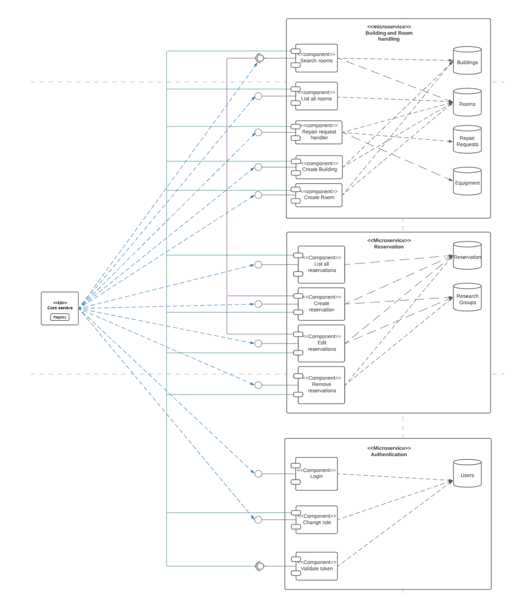
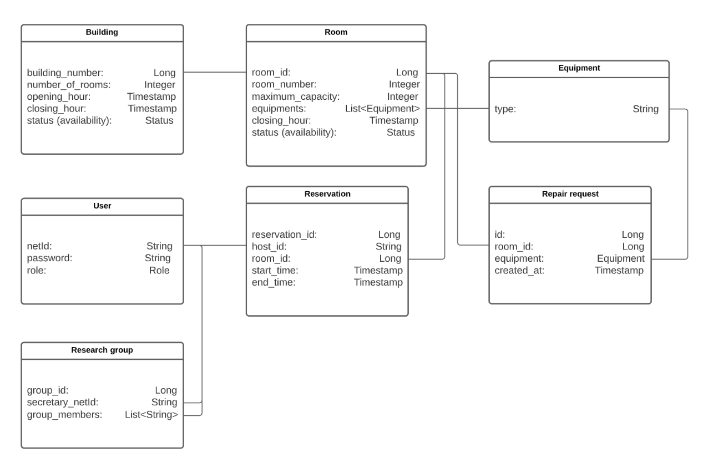

# Room Booking Server
The server implementation handles API requests for room booking, reservations, authentication, and various other services. It manages the following domains: buildings, rooms, reservations, users, equipment, repair requests, research groups, and authentication. The micro-schema is structured as outlined below.

    

Buildings and rooms, reservations, and users are core domains. Equipment, repair requests, and research groups are supporting domains.

# Authentication Service 
* The "Login" module is the user's entry point to obtain a unique token. It requires a valid Net-Id and password for authentication via the user database. Once verified, the system issues a valid token.
* The "Change role" module enables administrators to update user roles using their Net-Id.
* The "Validate token" module checks the authenticity of tokens provided by users during interactions with other microservices.

This microservice operates independently from other microservices, relying solely on its own data to perform tasks such as logins and role changes. Its only interaction with other services is for token validation, ensuring secure communication.

# Database Schema 

    

The provided repository includes unit tests that ensure 100% code coverage, as well as mutation tests.

